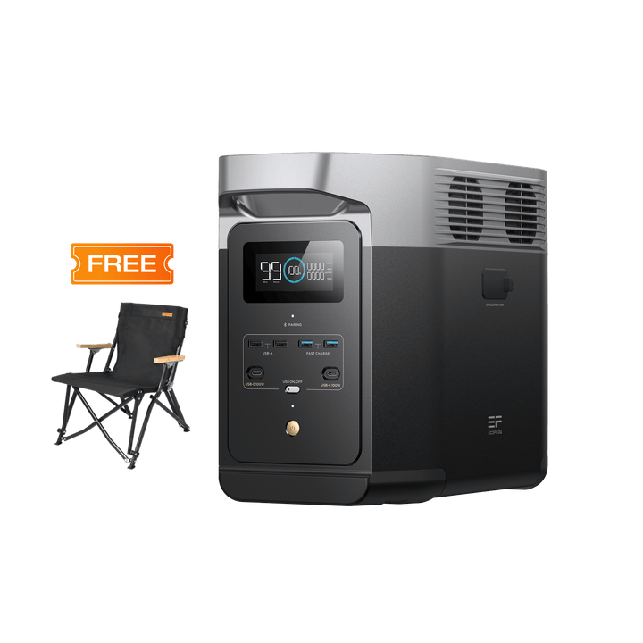

# EcoFlow Delta 2

<picture><source srcset="../../../custom_components/ecoflow_iot/www/devices/delta-2.webp" type="image/webp"></picture>

**Category:** Power Stations · **Auto-detected by SN prefix:** `R331`

> Generated from `custom_components/ecoflow_iot/devices/power_stations/delta_2.py` by `scripts/gen_device_docs.py` — do not edit by hand.
> Every device also exposes an always-available **Connection** diagnostic sensor (MQTT state + data source).

Legend: 🔧 = diagnostic entity · 💤 = disabled by default · 🌐 = HTTP-only (refreshed on a slower HTTP cadence, not via MQTT).

## Sensors

| Entity | Device class | Unit | Quota key | Flags |
|---|---|---|---|---|
| Battery | battery | % | `pd.soc` |  |
| Total input power | power | W | `pd.wattsInSum` |  |
| Total output power | power | W | `pd.wattsOutSum` |  |
| Remaining time | duration | min | `pd.remainTime` | 🔧 |
| USB-C 1 power | power | W | `pd.typec1Watts` |  |
| USB-C 2 power | power | W | `pd.typec2Watts` |  |
| USB-A 1 power | power | W | `pd.usb1Watts` |  |
| USB-A 2 power | power | W | `pd.usb2Watts` |  |
| USB QC 1 power | power | W | `pd.qcUsb1Watts` |  |
| USB QC 2 power | power | W | `pd.qcUsb2Watts` |  |
| Car output power | power | W | `pd.carWatts` |  |
| Car port temperature | temperature | °C | `pd.carTemp` | 🔧 |
| USB-C 1 temperature | temperature | °C | `pd.typec1Temp` | 🔧 💤 |
| USB-C 2 temperature | temperature | °C | `pd.typec2Temp` | 🔧 💤 |
| Total DC charged | energy | Wh | `pd.chgPowerDC` | 💤 |
| Total solar charged | energy | Wh | `pd.chgSunPower` |  |
| Total AC charged | energy | Wh | `pd.chgPowerAC` | 💤 |
| Total DC discharged | energy | Wh | `pd.dsgPowerDC` | 💤 |
| Total AC discharged | energy | Wh | `pd.dsgPowerAC` | 💤 |
| USB use time | duration | s | `pd.usbUsedTime` | 🔧 💤 |
| USB QC use time | duration | s | `pd.usbqcUsedTime` | 🔧 💤 |
| USB-C use time | duration | s | `pd.typecUsedTime` | 🔧 💤 |
| Car port use time | duration | s | `pd.carUsedTime` | 🔧 💤 |
| Inverter use time | duration | s | `pd.invUsedTime` | 🔧 💤 |
| DC charging time | duration | s | `pd.dcInUsedTime` | 🔧 💤 |
| MPPT use time | duration | s | `pd.mpptUsedTime` | 🔧 💤 |
| Device standby time | duration | min | `pd.standbyMin` | 🔧 |
| LCD timeout | duration | s | `pd.lcdOffSec` | 🔧 |
| Wi-Fi signal | signal_strength | dBm | `pd.wifiRssi` | 🔧 💤 |
| Charge/discharge state | — | — | `pd.chgDsgState` | 🔧 |
| Backup reserve level | battery | % | `pd.bpPowerSoc` | 🔧 |
| Battery SoC (BMS) | battery | % | `bms_bmsStatus.f32ShowSoc` |  |
| Battery voltage | voltage | V | `bms_bmsStatus.vol` | 🔧 |
| Battery current | current | A | `bms_bmsStatus.amp` | 🔧 |
| Battery temperature | temperature | °C | `bms_bmsStatus.temp` | 🔧 |
| Battery level (BMS integer) | battery | % | `bms_bmsStatus.soc` | 🔧 💤 |
| Battery health | — | % | `bms_bmsStatus.soh` | 🔧 |
| Battery design capacity | — | mAh | `bms_bmsStatus.designCap` | 🔧 💤 |
| Battery full capacity | — | mAh | `bms_bmsStatus.fullCap` | 🔧 💤 |
| Battery remaining capacity | — | mAh | `bms_bmsStatus.remainCap` | 🔧 💤 |
| Battery time remaining (BMS) | duration | min | `bms_bmsStatus.remainTime` | 🔧 💤 |
| Battery input power | power | W | `bms_bmsStatus.inputWatts` |  |
| Battery output power | power | W | `bms_bmsStatus.outputWatts` |  |
| Battery max cell temperature | temperature | °C | `bms_bmsStatus.maxCellTemp` | 🔧 💤 |
| Battery min cell temperature | temperature | °C | `bms_bmsStatus.minCellTemp` | 🔧 💤 |
| Battery max cell voltage | voltage | MILLIVOLT | `bms_bmsStatus.maxCellVol` | 🔧 💤 |
| Battery min cell voltage | voltage | MILLIVOLT | `bms_bmsStatus.minCellVol` | 🔧 💤 |
| Battery max MOS temperature | temperature | °C | `bms_bmsStatus.maxMosTemp` | 🔧 💤 |
| Battery min MOS temperature | temperature | °C | `bms_bmsStatus.minMosTemp` | 🔧 💤 |
| Battery error code | — | — | `bms_bmsStatus.errCode` | 🔧 💤 |
| Battery SoC (display) | battery | % | `bms_emsStatus.lcdShowSoc` | 💤 |
| Battery SoC (display float) | battery | % | `bms_emsStatus.f32LcdShowSoc` | 💤 |
| Charge upper limit | battery | % | `bms_emsStatus.maxChargeSoc` | 🔧 |
| Discharge lower limit | battery | % | `bms_emsStatus.minDsgSoc` | 🔧 |
| Time to full | duration | min | `bms_emsStatus.chgRemainTime` | 🔧 |
| Time to empty | duration | min | `bms_emsStatus.dsgRemainTime` | 🔧 |
| EMS charging voltage | voltage | MILLIVOLT | `bms_emsStatus.chgVol` | 🔧 💤 |
| EMS charging current | current | mA | `bms_emsStatus.chgAmp` | 🔧 💤 |
| EMS charging status | — | — | `bms_emsStatus.chgState` | 🔧 |
| Fan level | — | — | `bms_emsStatus.fanLevel` | 🔧 |
| BMS model | — | — | `bms_emsStatus.bmsModel` | 🔧 💤 |
| Smart Generator on SoC | battery | % | `bms_emsStatus.minOpenOilEb` | 🔧 |
| Smart Generator off SoC | battery | % | `bms_emsStatus.maxCloseOilEb` | 🔧 |
| BMS warning state | — | — | `bms_emsStatus.bmsWarState` | 🔧 💤 |
| AC charging power | power | W | `inv.inputWatts` |  |
| AC output power | power | W | `inv.outputWatts` |  |
| AC output voltage | voltage | V | `inv.invOutVol` | 🔧 |
| AC output current | current | A | `inv.invOutAmp` | 🔧 |
| AC output frequency | frequency | Hz | `inv.invOutFreq` | 🔧 |
| AC input voltage | voltage | V | `inv.acInVol` | 🔧 |
| AC input current | current | A | `inv.acInAmp` | 🔧 |
| AC input frequency | frequency | Hz | `inv.acInFreq` | 🔧 |
| Inverter temperature | temperature | °C | `inv.outTemp` | 🔧 |
| DC input voltage | voltage | V | `inv.dcInVol` | 🔧 💤 |
| DC input current | current | A | `inv.dcInAmp` | 🔧 💤 |
| DC input temperature | temperature | °C | `inv.dcInTemp` | 🔧 💤 |
| Charger type | — | — | `inv.chargerType` | 🔧 |
| AC fast charge power | power | W | `inv.FastChgWatts` | 🔧 💤 |
| AC standby time | duration | min | `inv.standbyMins` | 🔧 |
| Inverter error code | — | — | `inv.errCode` | 🔧 💤 |
| AC charging mode | — | — | `inv.cfgAcWorkMode` | 🔧 |
| Solar input power | power | W | `mppt.inWatts` |  |
| Solar input voltage | voltage | V | `mppt.inVol` | 🔧 |
| Solar input current | current | A | `mppt.inAmp` | 🔧 |
| MPPT output power | power | W | `mppt.outWatts` | 💤 |
| MPPT output voltage | voltage | V | `mppt.outVol` | 🔧 💤 |
| MPPT output current | current | A | `mppt.outAmp` | 🔧 💤 |
| MPPT temperature | temperature | °C | `mppt.mpptTemp` | 🔧 |
| Charging type | — | — | `mppt.chgType` | 🔧 |
| Solar charging status | — | — | `mppt.chgState` | 🔧 |
| 12 V car output power | power | W | `mppt.carOutWatts` |  |
| 12 V car output voltage | voltage | V | `mppt.carOutVol` | 🔧 💤 |
| 12 V car output current | current | A | `mppt.carOutAmp` | 🔧 💤 |
| Car charger temperature | temperature | °C | `mppt.carTemp` | 🔧 |
| DC 12 V output voltage | voltage | V | `mppt.dcdc12vVol` | 🔧 💤 |
| DC 12 V output current | current | A | `mppt.dcdc12vAmp` | 🔧 💤 |
| DC 12 V output power | power | W | `mppt.dcdc12vWatts` | 💤 |
| DCDC 24 V temperature | temperature | °C | `mppt.dc24vTemp` | 🔧 💤 |
| DC max charging current | current | mA | `mppt.dcChgCurrent` | 🔧 |
| AC max charging power | power | W | `mppt.cfgChgWatts` | 🔧 |
| AC standby (MPPT) | duration | min | `mppt.acStandbyMins` | 🔧 💤 |
| Car charger standby time | duration | min | `mppt.carStandbyMin` | 🔧 |
| XT60 paddle type | — | — | `mppt.x60ChgType` | 🔧 💤 |
| Configured charging type | — | — | `mppt.cfgChgType` | 🔧 💤 |
| MPPT fault code | — | — | `mppt.faultCode` | 🔧 💤 |
| Solar energy | energy | Wh | _integrated_ |  |
| Battery charge energy | energy | Wh | _integrated_ |  |
| Battery discharge energy | energy | Wh | _integrated_ |  |

## Binary sensors

| Entity | Device class | Quota key | Flags |
|---|---|---|---|
| Battery charging | battery_charging | `bms_bmsStatus.inputWatts` |  |
| Car charger | power | `mppt.carState` |  |
| DCDC 24 V output | power | `mppt.dc24vState` | 🔧 |
| AC output | power | `inv.cfgAcEnabled` |  |
| DC (USB) output | power | `pd.dcOutState` |  |
| UPS mode | — | `bms_emsStatus.openUpsFlag` | 🔧 |
| EMS normal | problem | `bms_emsStatus.emsIsNormalFlag` | 🔧 |
| X-Boost | — | `inv.cfgAcXboost` |  |
| Solar charging paused | problem | `mppt.chgPauseFlag` | 🔧 |
| Buzzer silent | — | `mppt.beepState` | 🔧 |
| Car output button | power | `pd.carState` |  |

## Switches

| Entity | Quota key | Flags |
|---|---|---|
| DC (USB) output | `pd.dcOutState` |  |
| Car charger | `mppt.carState` |  |
| Buzzer silent mode | `mppt.beepState` |  |
| AC always on | `pd.acAutoOutConfig` |  |
| Prioritize solar charging | `pd.pvChgPrioSet` |  |

## Numbers

| Entity | Unit | Range | Quota key | Flags |
|---|---|---|---|---|
| Device standby time | min | 0–5999 (step 1) | `pd.standbyMin` |  |
| LCD screen timeout | s | 0–300 (step 10) | `pd.lcdOffSec` |  |
| AC charging power | W | 200–1200 (step 100) | `mppt.cfgChgWatts` |  |
| AC standby time | min | 0–5999 (step 1) | `mppt.acStandbyMins` |  |
| Car charger standby time | min | 0–5999 (step 1) | `mppt.carStandbyMin` |  |
| DC max charging current | mA | 4000–10000 (step 1000) | `mppt.dcChgCurrent` |  |
| Charge upper limit | % | 50–100 (step 1) | `bms_emsStatus.maxChargeSoc` |  |
| Discharge lower limit | % | 0–30 (step 1) | `bms_emsStatus.minDsgSoc` |  |
| Smart Generator on SoC | % | 0–30 (step 1) | `bms_emsStatus.minOpenOilEb` |  |
| Smart Generator off SoC | % | 50–100 (step 1) | `bms_emsStatus.maxCloseOilEb` |  |
| Backup reserve level | % | 5–100 (step 1) | `pd.bpPowerSoc` |  |
| AC always-on minimum SoC | % | 0–100 (step 1) | `pd.minAcoutSoc` |  |

## Selects

| Entity | Options | Quota key | Flags |
|---|---|---|---|
| AC charging mode | full_power, mute | `inv.cfgAcWorkMode` | 🔧 |

---

_Entity totals: 137 — 108 sensor, 11 binary_sensor, 5 switch, 12 number, 1 select._
