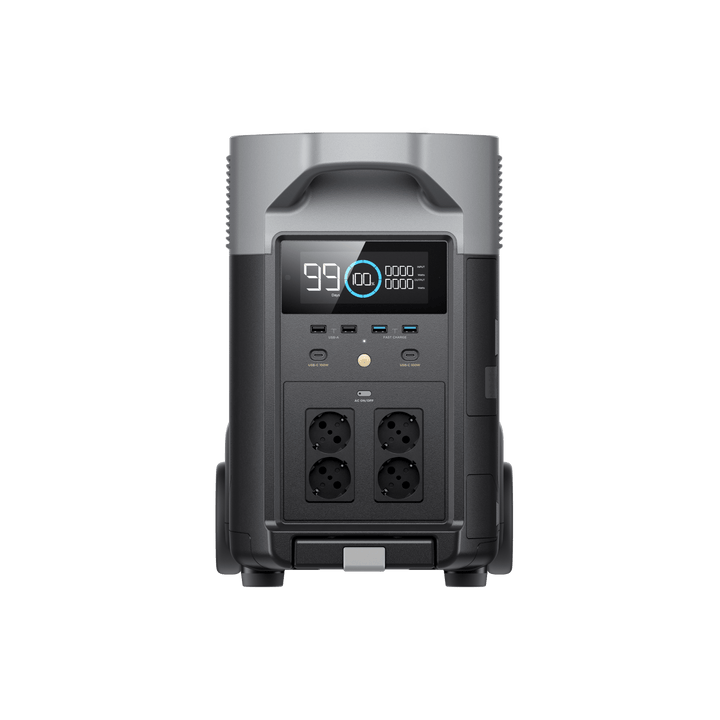

# EcoFlow Delta Pro

<picture><source srcset="../../../custom_components/ecoflow_iot/www/devices/delta-pro.webp" type="image/webp"></picture>

**Category:** Power Stations · **Auto-detected by SN prefix:** `DCABZ`

> Generated from `custom_components/ecoflow_iot/devices/power_stations/delta_pro.py` by `scripts/gen_device_docs.py` — do not edit by hand.
> Every device also exposes an always-available **Connection** diagnostic sensor (MQTT state + data source).

Legend: 🔧 = diagnostic entity · 💤 = disabled by default · 🌐 = HTTP-only (refreshed on a slower HTTP cadence, not via MQTT) · ⚠️ = undocumented (reverse-engineered, may break).

## Sensors

| Entity | Device class | Unit | Quota key | Flags |
|---|---|---|---|---|
| Battery | battery | % | `bmsMaster.soc` |  |
| Battery temperature | temperature | °C | `bmsMaster.temp` |  |
| Battery input power | power | W | `bmsMaster.inputWatts` |  |
| Battery output power | power | W | `bmsMaster.outputWatts` |  |
| Battery voltage | voltage | V | `bmsMaster.vol` | 🔧 💤 |
| Battery current | current | A | `bmsMaster.amp` | 🔧 💤 |
| Battery health | — | % | `bmsMaster.soh` | 🔧 |
| Battery design capacity | energy_storage | — | `bmsMaster.designCap` | 🔧 💤 |
| Battery remaining capacity | energy_storage | — | `bmsMaster.remainCap` | 🔧 💤 |
| Battery full capacity | energy_storage | — | `bmsMaster.fullCap` | 🔧 💤 |
| Battery time remaining | duration | min | `bmsMaster.remainTime` | 🔧 |
| Battery max cell voltage | voltage | mV | `bmsMaster.maxCellVol` | 🔧 💤 |
| Battery min cell voltage | voltage | mV | `bmsMaster.minCellVol` | 🔧 💤 |
| Battery max cell temperature | temperature | °C | `bmsMaster.maxCellTemp` | 🔧 💤 |
| Battery min cell temperature | temperature | °C | `bmsMaster.minCellTemp` | 🔧 💤 |
| Battery target charge current | current | mA | `bmsMaster.tagChgAmp` | 🔧 💤 |
| Battery SOC (precise) | battery | % | `bmsMaster.f32ShowSoc` | 🔧 💤 |
| AC charging power | power | W | `inv.inputWatts` |  |
| AC output power | power | W | `inv.outputWatts` |  |
| AC output voltage | voltage | V | `inv.invOutVol` | 🔧 |
| AC output current | current | A | `inv.invOutAmp` | 🔧 |
| AC output frequency | frequency | Hz | `inv.invOutFreq` | 🔧 |
| AC input voltage | voltage | V | `inv.acInVol` | 🔧 |
| AC input current | current | A | `inv.acInAmp` | 🔧 |
| AC input frequency | frequency | Hz | `inv.acInFreq` | 🔧 |
| Inverter temperature | temperature | °C | `inv.outTemp` | 🔧 |
| DC adapter input voltage | voltage | V | `inv.dcInVol` | 🔧 💤 |
| DC adapter input current | current | A | `inv.dcInAmp` | 🔧 💤 |
| DC adapter temperature | temperature | °C | `inv.dcInTemp` | 🔧 💤 |
| AC standby time | duration | min | `inv.cfgStandbyMin` | 🔧 💤 |
| AC slow charge power | power | W | `inv.cfgSlowChgWatts` | 🔧 💤 |
| AC fast charge power | power | W | `inv.cfgFastChgWatts` | 🔧 💤 |
| Solar input power | power | W | `mppt.inWatts` |  |
| Solar input voltage | voltage | V | `mppt.inVol` | 🔧 |
| Solar input current | current | A | `mppt.inAmp` | 🔧 |
| MPPT output power | power | W | `mppt.outWatts` | 🔧 💤 |
| MPPT temperature | temperature | °C | `mppt.mpptTemp` | 🔧 |
| DC 12V output power | power | W | `mppt.dcdc12vWatts` |  |
| DC 12V output voltage | voltage | V | `mppt.dcdc12vVol` | 🔧 💤 |
| DC 12V output current | current | A | `mppt.dcdc12vAmp` | 🔧 💤 |
| Car charger output power | power | W | `mppt.carOutWatts` |  |
| Car charger temperature | temperature | °C | `mppt.carTemp` | 🔧 |
| DC 24V temperature | temperature | °C | `mppt.dc24vTemp` | 🔧 💤 |
| Car input current limit | current | mA | `mppt.cfgDcChgCurrent` | 🔧 💤 |
| Display SOC | battery | % | `pd.soc` | 🔧 💤 |
| Total output power | power | W | `pd.wattsOutSum` |  |
| Total input power | power | W | `pd.wattsInSum` |  |
| Time remaining | duration | min | `pd.remainTime` |  |
| USB 1 output power | power | W | `pd.usb1Watts` |  |
| USB 2 output power | power | W | `pd.usb2Watts` |  |
| USB QC1 output power | power | W | `pd.qcUsb1Watts` |  |
| USB QC2 output power | power | W | `pd.qcUsb2Watts` |  |
| USB-C 1 output power | power | W | `pd.typec1Watts` |  |
| USB-C 2 output power | power | W | `pd.typec2Watts` |  |
| USB-C 1 temperature | temperature | °C | `pd.typec1Temp` | 🔧 💤 |
| USB-C 2 temperature | temperature | °C | `pd.typec2Temp` | 🔧 💤 |
| CAR output power | power | W | `pd.carWatts` |  |
| CAR temperature | temperature | °C | `pd.carTemp` | 🔧 💤 |
| Total DC charged | energy | Wh | `pd.chgPowerDc` |  |
| Total solar charged | energy | Wh | `pd.chgSunPower` |  |
| Total AC charged | energy | Wh | `pd.chgPowerAc` |  |
| Total DC discharged | energy | Wh | `pd.dsgPowerDc` |  |
| Total AC discharged | energy | Wh | `pd.dsgPowerAc` |  |
| Wi-Fi signal | signal_strength | dBm | `pd.wifiRssi` | 🔧 💤 |
| Screen timeout | duration | s | `pd.lcdOffSec` | 🔧 💤 |
| Device standby time | duration | min | `pd.standByMode` | 🔧 💤 |
| Time to full | duration | min | `ems.chgRemainTime` | 🔧 |
| Time to empty | duration | min | `ems.dsgRemainTime` | 🔧 |
| Charge upper limit | — | % | `ems.maxChargeSoc` | 🔧 💤 |
| Discharge lower limit | — | % | `ems.minDsgSoc` | 🔧 💤 |
| Generator auto-on threshold | — | % | `ems.minOpenOilEbSoc` | 🔧 💤 |
| Generator auto-off threshold | — | % | `ems.maxCloseOilEbSoc` | 🔧 💤 |
| EMS LCD SOC | battery | % | `ems.lcdShowSoc` | 🔧 💤 |
| Solar energy | energy | Wh | _integrated_ |  |
| Battery charge energy | energy | Wh | _integrated_ |  |
| Battery discharge energy | energy | Wh | _integrated_ |  |

## Binary sensors

| Entity | Device class | Quota key | Flags |
|---|---|---|---|
| Battery charging | battery_charging | `bmsMaster.inputWatts` |  |
| AC output enabled | power | `inv.cfgAcEnabled` |  |
| X-Boost enabled | — | `inv.cfgAcXboost` | 🔧 |
| Car charger enabled | power | `mppt.carState` |  |
| DC 24V output enabled | power | `mppt.dc24vState` |  |
| DC output enabled | power | `pd.dcOutState` |  |
| UPS mode enabled | — | `ems.openUpsFlag` | 🔧 |
| AC charging paused | — | `inv.chgPauseFlag` | 🔧 💤 |
| PV charging paused | — | `mppt.chgPauseFlag` | 🔧 💤 |
| Bypass AC auto start | — | `inv.acPassbyAutoEn` | 🔧 |

## Switches

| Entity | Quota key | Flags |
|---|---|---|
| AC output | `inv.cfgAcEnabled` |  |
| X-Boost | `inv.cfgAcXboost` |  |
| Car charger | `mppt.carState` |  |
| Beep | `pd.beepState` |  |
| Bypass AC auto start | `inv.acPassbyAutoEn` |  |

## Numbers

| Entity | Unit | Range | Quota key | Flags |
|---|---|---|---|---|
| Charge limit | % | 50–100 (step 1) | `ems.maxChargeSoc` |  |
| Discharge limit | % | 0–30 (step 1) | `ems.minDsgSoc` |  |
| Car input current | mA | 0–8000 (step 1000) | `mppt.cfgDcChgCurrent` |  |
| Device standby time | min | 0–5999 (step 1) | `pd.standByMode` |  |
| AC standby time | min | 0–5999 (step 1) | `inv.cfgStandbyMin` |  |
| Screen brightness | — | 0–100 (step 1) | `pd.lcdBrightness` |  |
| AC slow charge power | W | 100–1400 (step 100) | `inv.cfgSlowChgWatts` |  |
| Generator auto-on threshold | % | 0–100 (step 1) | `ems.minOpenOilEbSoc` |  |
| Generator auto-off threshold | % | 0–100 (step 1) | `ems.maxCloseOilEbSoc` |  |

## Selects

| Entity | Options | Quota key | Flags |
|---|---|---|---|
| PV charging type | auto, mppt, adapter | _derived_ |  |
| AC charging mode | full_power, mute | _derived_ |  |

---

_Entity totals: 102 — 76 sensor, 10 binary_sensor, 5 switch, 9 number, 2 select, 0 light._
