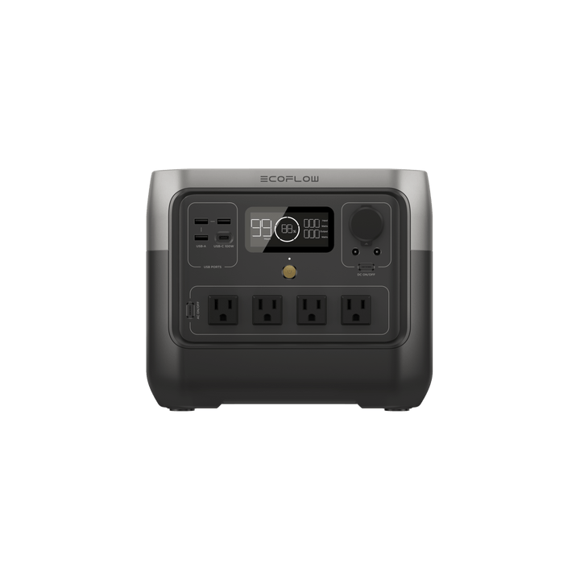

# EcoFlow River 2 Pro

<picture><source srcset="../../../custom_components/ecoflow_iot/www/devices/river-2-pro.webp" type="image/webp"></picture>

**Category:** Power Stations · **Auto-detected by SN prefix:** `R621`

> Generated from `custom_components/ecoflow_iot/devices/power_stations/river_2_pro.py` by `scripts/gen_device_docs.py` — do not edit by hand.
> Every device also exposes an always-available **Connection** diagnostic sensor (MQTT state + data source).

Legend: 🔧 = diagnostic entity · 💤 = disabled by default · 🌐 = HTTP-only (refreshed on a slower HTTP cadence, not via MQTT) · ⚠️ = undocumented (reverse-engineered, may break).

## Sensors

| Entity | Device class | Unit | Quota key | Flags |
|---|---|---|---|---|
| Battery | battery | % | `pd.soc` |  |
| Time to full | duration | min | `bms_bmsStatus.remainTime` | 🔧 |
| Time to empty | duration | min | `bms_emsStatus.dsgRemainTime` | 🔧 |
| Total output power | power | W | `pd.wattsOutSum` |  |
| DC output power | power | W | `pd.carWatts` |  |
| USB-A output power | power | W | `pd.usb1Watts` | 🔧 💤 |
| USB-C input power | power | W | `pd.typecChaWatts` | 🔧 💤 |
| USB-C output power | power | W | `pd.typec1Watts` | 🔧 💤 |
| AC input power | power | W | `inv.inputWatts` |  |
| AC output power | power | W | `inv.outputWatts` |  |
| Solar input power | power | W | `mppt.inWatts` |  |
| AC output voltage | voltage | V | `mppt.cfgAcOutVol` | 🔧 💤 |
| Charge limit (reported) | — | % | `bms_emsStatus.maxChargeSoc` | 🔧 💤 |
| Discharge limit (reported) | — | % | `bms_emsStatus.minDsgSoc` | 🔧 💤 |
| Backup reserve (reported) | — | % | `pd.bpPowerSoc` | 🔧 💤 |
| AC output frequency (raw) | frequency | Hz | `mppt.cfgAcOutFreq` | 🔧 💤 |
| Solar energy | energy | Wh | _integrated_ |  |

## Binary sensors

| Entity | Device class | Quota key | Flags |
|---|---|---|---|
| Battery charging | battery_charging | _computed_ |  |
| 12V DC output | power | `pd.carState` |  |
| Energy management | running | `pd.watchIsConfig` | 🔧 |
| AC output enabled | power | `mppt.cfgAcEnabled` |  |
| X-Boost | — | `mppt.cfgAcXboost` | 🔧 |

## Switches

| Entity | Quota key | Flags |
|---|---|---|
| AC output | `mppt.cfgAcEnabled` |  |
| X-Boost | `mppt.cfgAcXboost` |  |
| 12V DC output | `pd.carState` |  |
| Energy management | `pd.watchIsConfig` |  |

## Numbers

| Entity | Unit | Range | Quota key | Flags |
|---|---|---|---|---|
| Charge limit | % | 50–100 (step 1) | `bms_emsStatus.maxChargeSoc` |  |
| Discharge limit | % | 0–30 (step 1) | `bms_emsStatus.minDsgSoc` |  |
| Backup reserve | % | 0–100 (step 1) | `pd.bpPowerSoc` |  |

## Selects

| Entity | Options | Quota key | Flags |
|---|---|---|---|
| AC output frequency | 50 Hz, 60 Hz | _derived_ |  |

---

_Entity totals: 30 — 17 sensor, 5 binary_sensor, 4 switch, 3 number, 1 select, 0 light._
