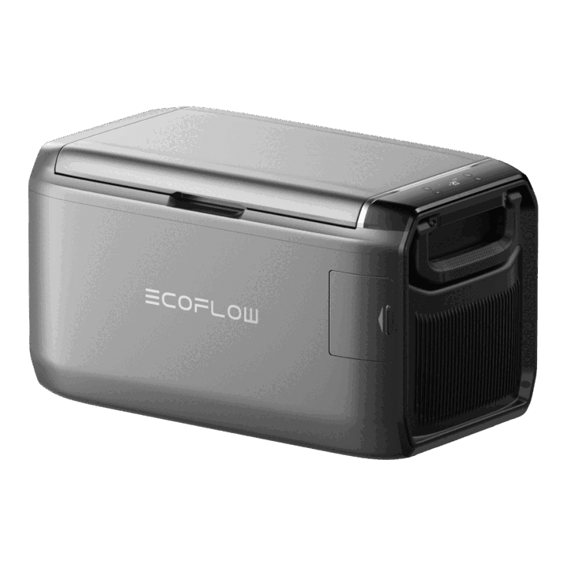

# EcoFlow Glacier

<picture><source srcset="../../../custom_components/ecoflow_iot/www/devices/glacier.webp" type="image/webp"></picture>

**Category:** Smart Living · **Auto-detected by SN prefix:** `BX11Z`

> Generated from `custom_components/ecoflow_iot/devices/smart_living/glacier.py` by `scripts/gen_device_docs.py` — do not edit by hand.
> Every device also exposes an always-available **Connection** diagnostic sensor (MQTT state + data source).

Legend: 🔧 = diagnostic entity · 💤 = disabled by default · 🌐 = HTTP-only (refreshed on a slower HTTP cadence, not via MQTT) · ⚠️ = undocumented (reverse-engineered, may break).

## Sensors

| Entity | Device class | Unit | Quota key | Flags |
|---|---|---|---|---|
| Battery | battery | % | `bms_bmsStatus.f32ShowSoc` |  |
| Battery (integer) | battery | % | `bms_bmsStatus.soc` | 🔧 💤 |
| Battery (PD) | battery | % | `pd.batPct` | 🔧 💤 |
| Battery voltage | voltage | V | `bms_bmsStatus.vol` | 🔧 |
| Battery current | current | A | `bms_bmsStatus.amp` | 🔧 |
| Battery input power | power | W | `bms_bmsStatus.inWatts` | 🔧 |
| Battery output power | power | W | `bms_bmsStatus.outWatts` | 🔧 |
| Battery temperature | temperature | °C | `bms_bmsStatus.tmp` |  |
| Battery health | — | % | `bms_bmsStatus.soh` | 🔧 💤 |
| Battery time | duration | min | `pd.batTime` | 🔧 |
| Time to full | duration | min | `bms_emsStatus.chgRemain` | 🔧 |
| Time to empty | duration | min | `bms_emsStatus.dsgRemain` | 🔧 |
| Right zone temperature | temperature | °C | `pd.tmpR` |  |
| Left zone temperature | temperature | °C | `pd.tmpL` |  |
| Single zone temperature | temperature | °C | `pd.tmpAver` |  |
| Ambient temperature | temperature | °C | `pd.ambientTmp` | 🔧 |
| Ice zone water temperature | temperature | °C | `pd.tempWater` | 🔧 💤 |
| Exhaust temperature | temperature | °C | `pd.exhaustTmp` | 🔧 💤 |
| Compressor power | power | W | `pd.motorWat` | 🔧 💤 |
| Compressor current | current | A | `pd.motorCur` | 🔧 💤 |
| Compressor voltage | voltage | V | `pd.motorVol` | 🔧 💤 |
| Compressor speed | — | rpm | `pd.motorSpeed` | 🔧 💤 |
| Fan level | — | — | `pd.fanLvl` | 🔧 💤 |
| Ice making progress | — | % | `pd.icePercent` |  |
| Ice making duration | duration | s | `pd.iceTm` | 🔧 💤 |
| Water level | — | — | `pd.waterLine` | 🔧 |
| Right zone setpoint | temperature | °C | `pd.tmpRSet` | 🔧 💤 |
| Left zone setpoint | temperature | °C | `pd.tmpLSet` | 🔧 💤 |
| Combined zone setpoint | temperature | °C | `pd.tmpMSet` | 🔧 💤 |
| Running state | — | — | `pd.fsmState` | 🔧 💤 |
| Operating status | — | — | `pd.runState` | 🔧 💤 |
| Charger type | — | — | `pd.chgType` | 🔧 💤 |
| Error code | — | — | `pd.errCode` | 🔧 💤 |
| BMS fault code | — | — | `pd.errBms` | 🔧 💤 |
| PD fault code | — | — | `pd.errPd` | 🔧 💤 |
| Power fault code | — | — | `pd.errPwr` | 🔧 💤 |
| BLDC fault code | — | — | `pd.errBldc` | 🔧 💤 |
| 12V auxiliary voltage | voltage | V | `pd.A12Val` | 🔧 💤 |
| Battery min cell voltage | voltage | V | `bms_bmsStatus.minCellVol` | 🔧 💤 |
| Battery max cell voltage | voltage | V | `bms_bmsStatus.maxCellVol` | 🔧 💤 |
| Battery min cell temperature | temperature | °C | `bms_bmsStatus.minCellTmp` | 🔧 💤 |
| Battery max cell temperature | temperature | °C | `bms_bmsStatus.maxCellTmp` | 🔧 💤 |
| LCD SoC | battery | % | `bms_emsStatus.lcdSoc` | 🔧 💤 |
| Screen timeout | duration | s | `pd.blTime` | 🔧 💤 |
| Battery charge energy | energy | Wh | _integrated_ |  |
| Battery discharge energy | energy | Wh | _integrated_ |  |

## Binary sensors

| Entity | Device class | Quota key | Flags |
|---|---|---|---|
| Power | power | `pd.pwrState` |  |
| Door | door | `pd.doorStat` |  |
| Battery pack | connectivity | `pd.batFlag` | 🔧 |
| BMS connected | connectivity | `pd.bmsInFlag` | 🔧 💤 |
| XT60 input | plug | `pd.xt60InState` | 🔧 💤 |
| XT150 input | plug | `pd.xt150InState` | 🔧 💤 |
| Compressor waiting | running | `pd.motorWait` | 🔧 💤 |
| Dual zone partition | — | `pd.flagTwoZone` | 🔧 |
| Ice ready | — | `pd.iceAlert` |  |
| Car battery low | battery | `pd.carBatLow` | 🔧 |
| Ambient sensor reliable | — | `pd.flagAmbintReady` | 🔧 💤 |
| EMS charging | battery_charging | `pd.emsChgFlg` | 🔧 💤 |
| Compressor allowed | running | `pd.bldcDntWork` | 🔧 💤 |
| Ice making allowed | — | `pd.bldcDntIce` | 🔧 💤 |
| Battery protection enabled | — | `pd.pwrPbEn` | 🔧 |

## Switches

| Entity | Quota key | Flags |
|---|---|---|
| ECO mode | `pd.coolMode` |  |
| Buzzer | `pd.beepEn` |  |
| Battery low voltage protection | `pd.pwrPbEn` |  |
| Sensor detection blocking | `pd.sensorAdv` | 🔧 💤 |

## Numbers

| Entity | Unit | Range | Quota key | Flags |
|---|---|---|---|---|
| Right zone setpoint | °C | -25–10 (step 1) | `pd.tmpRSet` |  |
| Left zone setpoint | °C | -25–10 (step 1) | `pd.tmpLSet` |  |
| Combined zone setpoint | °C | -25–10 (step 1) | `pd.tmpMSet` |  |
| Screen timeout | s | 0–3600 (step 10) | `pd.blTime` |  |

## Selects

| Entity | Options | Quota key | Flags |
|---|---|---|---|
| Ice maker | off, small, large | _derived_ |  |
| Battery protection level | low, medium, high | _derived_ |  |
| Temperature unit | celsius, fahrenheit | _derived_ |  |

---

_Entity totals: 72 — 46 sensor, 15 binary_sensor, 4 switch, 4 number, 3 select, 0 light._
