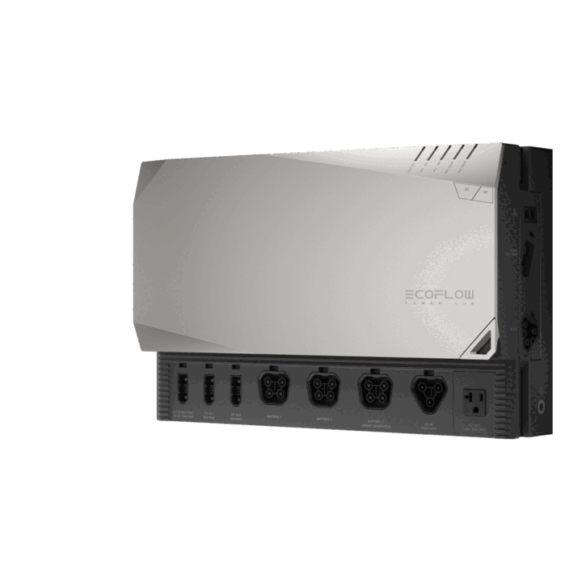

# EcoFlow Power Kits

**Category:** Smart Living · **Auto-detected by SN prefix:** `M106Z`, `M109Z`, `M102Z`, `M10EZ`, `M10E1`, `M106W`

> Generated from `custom_components/ecoflow_iot/devices/smart_living/power_kits.py` by `scripts/gen_device_docs.py` — do not edit by hand.
> Every device also exposes an always-available **Connection** diagnostic sensor (MQTT state + data source).

Legend: 🔧 = diagnostic entity · 💤 = disabled by default · 🌐 = HTTP-only (refreshed on a slower HTTP cadence, not via MQTT).

## Sensors

| Entity | Device class | Unit | Quota key | Flags |
|---|---|---|---|---|
| Total battery input power | power | W | `totalInWatts` |  |
| Total battery output power | power | W | `totalOutWatts` |  |
| Total battery current | current | A | `totalAmp` | 🔧 |
| System remaining time | duration | min | `totalRemainTime` | 🔧 |
| Total battery capacity | — | — | `totalFullCap` | 🔧 💤 |
| Generator start SOC lower limit | — | % | `oilStartDownline` | 🔧 💤 |
| Generator stop SOC upper limit | — | % | `oilStopUpline` | 🔧 💤 |
| BMS UPS charge upper limit | — | % | `bmsChgUpline` | 🔧 💤 |
| BMS UPS discharge lower limit | — | % | `bmsDsgDownline` | 🔧 💤 |
| Battery state of charge | battery | % | `soc` |  |
| Battery total SOC | battery | % | `totalSoc` | 💤 |
| Battery voltage | voltage | V | `vol` | 🔧 |
| Battery current | current | A | `amp` | 🔧 |
| Battery temperature | temperature | °C | `temp` |  |
| Battery max cell temperature | temperature | °C | `maxCellTemp` | 🔧 💤 |
| Battery min cell temperature | temperature | °C | `minCellTemp` | 🔧 💤 |
| Battery max cell voltage | voltage | V | `maxCellVol` | 🔧 💤 |
| Battery min cell voltage | voltage | V | `minCellVol` | 🔧 💤 |
| Battery input power | power | W | `inWatts` |  |
| Battery output power | power | W | `outWatts` |  |
| Battery remaining time | duration | min | `remainTime` | 🔧 |
| Battery full capacity | energy_storage | — | `fullCap` | 🔧 💤 |
| Battery remaining capacity | — | — | `remainCap` | 🔧 💤 |
| Battery design capacity | — | — | `designCap` | 🔧 💤 |
| Battery charge upper limit | — | % | `chgSetSoc` | 🔧 |
| Battery discharge lower limit | — | % | `dsgSetSoc` | 🔧 |
| DC input power | power | W | `dcInWatts` |  |
| DC input voltage | voltage | V | `dcInVol` | 🔧 |
| DC input current | current | A | `dcInCurr` | 🔧 |
| BBC IN battery power | power | W | `batWatts` | 💤 |
| BBC IN battery voltage | voltage | V | `batVol` | 🔧 💤 |
| BBC IN radiator 1 temperature | temperature | °C | `hs1Temp` | 🔧 💤 |
| BBC IN radiator 2 temperature | temperature | °C | `hs2Temp` | 🔧 💤 |
| DC input daily energy | energy | Wh | `dayEnergy` | 💤 |
| DC input total energy | energy | Wh | `dsgEnergy` | 💤 |
| DC input max charge current | current | A | `chgMaxCurr` | 🔧 💤 |
| DC hub output power | power | W | `ldOutWatts` |  |
| DC hub output voltage | voltage | V | `ldOutVol` | 🔧 |
| DC hub output current | current | A | `ldOutCurr` | 🔧 |
| BBC OUT battery power | power | W | `batWatts` | 💤 |
| BBC OUT battery voltage | voltage | V | `batVol` | 🔧 💤 |
| BBC OUT radiator 1 temperature | temperature | °C | `hs1Temp` | 🔧 💤 |
| DC output daily energy | energy | Wh | `dayEnergy` | 💤 |
| DC output total energy | energy | Wh | `dsgEnergy` | 💤 |
| Inverter battery SOC | battery | % | `realSoc` | 💤 |
| Inverter charging voltage | voltage | V | `chgBatVol` | 🔧 💤 |
| Inverter bus voltage | voltage | V | `busVol` | 🔧 💤 |
| Inverter DC temperature | temperature | °C | `dcTemp` | 🔧 💤 |
| Inverter fan level | — | — | `fanLevel` | 🔧 💤 |
| BMS chargeable current | current | A | `bmsChgCurr` | 🔧 💤 |
| Inverter input power | power | W | `inWatts` |  |
| Inverter output power | power | W | `outWatts` |  |
| Inverter input voltage | voltage | V | `inVol` | 🔧 |
| Inverter output voltage | voltage | V | `outVol` | 🔧 |
| Inverter input current | current | A | `inCurr` | 🔧 💤 |
| Inverter output current | current | A | `outCurr` | 🔧 💤 |
| Inverter input frequency | frequency | Hz | `inFreq` | 🔧 💤 |
| Inverter output frequency | frequency | Hz | `outFreq` | 🔧 💤 |
| Inverter AC temperature | temperature | °C | `acTemp` | 🔧 💤 |
| Inverter daily input energy | energy | Wh | `inputWhInDay` | 💤 |
| Inverter daily output energy | energy | Wh | `outputWhInDay` | 💤 |
| Inverter max AC input current | current | A | `acMaxCurrSer` | 🔧 💤 |
| Solar 1 input power | power | W | `pv1InWatts` |  |
| Solar 2 input power | power | W | `pv2InWatts` |  |
| Solar 1 input voltage | voltage | V | `pv1InVol` | 🔧 |
| Solar 2 input voltage | voltage | V | `pv2InVol` | 🔧 |
| Solar 1 input current | current | A | `pv1InCurr` | 🔧 💤 |
| Solar 2 input current | current | A | `pv2InCurr` | 🔧 💤 |
| Solar controller battery power | power | W | `batWatts` | 💤 |
| Solar controller battery voltage | voltage | V | `batVol` | 🔧 💤 |
| Solar controller battery current | current | A | `batCurr` | 🔧 💤 |
| Solar total charged energy | energy | Wh | `chgEnergy` |  |
| Solar daily energy | energy | Wh | `dayEnergy` | 💤 |
| Solar controller radiator 1 temperature | temperature | °C | `hs1Temp` | 🔧 💤 |
| Solar controller radiator 2 temperature | temperature | °C | `hs2Temp` | 🔧 💤 |
| AC panel total power | power | W | `acTotalWatts` |  |
| AC panel input voltage | voltage | V | `acInVol` | 🔧 |
| AC panel PCB temperature 1 | temperature | °C | `acTemp1` | 🔧 💤 |
| AC panel PCB temperature 2 | temperature | °C | `acTemp2` | 🔧 💤 |
| AC circuit 1 power | power | W | _computed_ |  |
| AC circuit 1 current | current | A | _computed_ | 🔧 💤 |
| AC circuit 2 power | power | W | _computed_ |  |
| AC circuit 2 current | current | A | _computed_ | 🔧 💤 |
| AC circuit 3 power | power | W | _computed_ |  |
| AC circuit 3 current | current | A | _computed_ | 🔧 💤 |
| AC circuit 4 power | power | W | _computed_ |  |
| AC circuit 4 current | current | A | _computed_ | 🔧 💤 |
| AC circuit 5 power | power | W | _computed_ |  |
| AC circuit 5 current | current | A | _computed_ | 🔧 💤 |
| AC circuit 6 power | power | W | _computed_ |  |
| AC circuit 6 current | current | A | _computed_ | 🔧 💤 |
| DC panel total power | power | W | `dcTotalWatts` |  |
| DC panel input voltage | voltage | V | `dcInVol` | 🔧 |
| DC panel PCB temperature 1 | temperature | °C | `dcTemp1` | 🔧 💤 |
| DC panel PCB temperature 2 | temperature | °C | `dcTemp2` | 🔧 💤 |
| DC circuit 1 power | power | W | _computed_ | 💤 |
| DC circuit 1 current | current | A | _computed_ | 🔧 💤 |
| DC circuit 2 power | power | W | _computed_ | 💤 |
| DC circuit 2 current | current | A | _computed_ | 🔧 💤 |
| DC circuit 3 power | power | W | _computed_ | 💤 |
| DC circuit 3 current | current | A | _computed_ | 🔧 💤 |
| DC circuit 4 power | power | W | _computed_ | 💤 |
| DC circuit 4 current | current | A | _computed_ | 🔧 💤 |
| DC circuit 5 power | power | W | _computed_ | 💤 |
| DC circuit 5 current | current | A | _computed_ | 🔧 💤 |
| DC circuit 6 power | power | W | _computed_ | 💤 |
| DC circuit 6 current | current | A | _computed_ | 🔧 💤 |
| DC circuit 7 power | power | W | _computed_ | 💤 |
| DC circuit 7 current | current | A | _computed_ | 🔧 💤 |
| DC circuit 8 power | power | W | _computed_ | 💤 |
| DC circuit 8 current | current | A | _computed_ | 🔧 💤 |
| DC circuit 9 power | power | W | _computed_ | 💤 |
| DC circuit 9 current | current | A | _computed_ | 🔧 💤 |
| DC circuit 10 power | power | W | _computed_ | 💤 |
| DC circuit 10 current | current | A | _computed_ | 🔧 💤 |
| DC circuit 11 power | power | W | _computed_ | 💤 |
| DC circuit 11 current | current | A | _computed_ | 🔧 💤 |
| DC circuit 12 power | power | W | _computed_ | 💤 |
| DC circuit 12 current | current | A | _computed_ | 🔧 💤 |
| Solar energy | energy | Wh | _integrated_ |  |
| Battery charge energy | energy | Wh | _integrated_ |  |
| Battery discharge energy | energy | Wh | _integrated_ |  |

## Binary sensors

| Entity | Device class | Quota key | Flags |
|---|---|---|---|
| Battery charging | battery_charging | `inWatts` |  |
| DC input connected | connectivity | `dcInState` | 🔧 |
| DC input charging paused | problem | `chgPause` | 🔧 |
| Inverter low power mode | — | `lsplFlag` | 🔧 💤 |
| Inverter enabled | power | `invSwSta` |  |
| Solar 1 input active | power | `pv1InputFlag` | 🔧 |
| Solar 2 input active | power | `pv2InputFlag` | 🔧 |
| Battery PTC heating | heat | `ptcHeatingFlag` | 🔧 💤 |
| Battery UPS mode | — | `upsFlag` | 🔧 💤 |
| BMS permanent fault | problem | `bmsFault` | 🔧 |

## Switches

| Entity | Quota key | Flags |
|---|---|---|
| DC output | `dcOutSta` |  |
| AC inverter output | `powerOn` |  |
| Grid power priority (passthrough) | `passByModeEn` |  |
| Pause DC charging | `chgPause` |  |
| Battery heating (by discharging) | `ptcAllowFlag` |  |

## Numbers

| Entity | Unit | Range | Quota key | Flags |
|---|---|---|---|---|
| Battery charge upper limit | % | 50–100 (step 1) | `chgSetSoc` |  |
| Battery discharge lower limit | % | 0–50 (step 1) | `dsgSetSoc` |  |
| Display standby time | s | 0–3600 (step 30) | `lcdStandbyMin` |  |
| Generator start SOC | % | 0–100 (step 1) | `oilStartDownline` |  |
| Generator stop SOC | % | 0–100 (step 1) | `oilStopUpline` |  |
| DC output voltage tag (0=12V 1=24V) | — | 0–1 (step 1) | `cfgVolTag` |  |
| AC input current limit | A | 1–23 (step 1) | `acMaxCurrSer` |  |

---

_Entity totals: 144 — 122 sensor, 10 binary_sensor, 5 switch, 7 number, 0 select._
