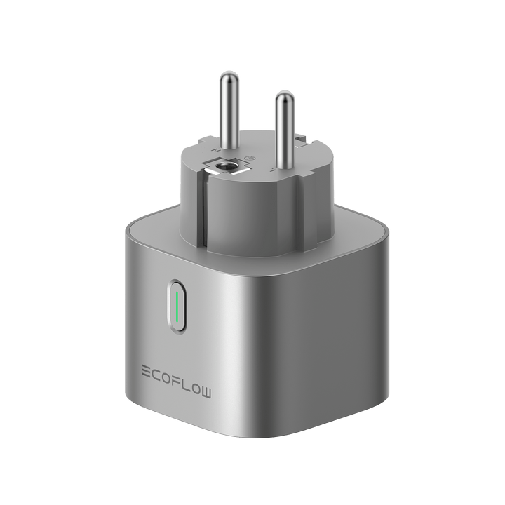

# EcoFlow Smart Plug

**Category:** Smart Living · **Auto-detected by SN prefix:** `HW52`

> Generated from `custom_components/ecoflow_iot/devices/smart_living/smart_plug.py` by `scripts/gen_device_docs.py` — do not edit by hand.
> Every device also exposes an always-available **Connection** diagnostic sensor (MQTT state + data source).

Legend: 🔧 = diagnostic entity · 💤 = disabled by default · 🌐 = HTTP-only (refreshed on a slower HTTP cadence, not via MQTT).

## Sensors

| Entity | Device class | Unit | Quota key | Flags |
|---|---|---|---|---|
| Power | power | W | `2_1.watts` |  |
| Current | current | A | `2_1.current` |  |
| Voltage | voltage | V | `2_1.volt` |  |
| Temperature | temperature | °C | `2_1.temp` | 🔧 |
| Max current | current | A | `2_1.maxCur` | 🔧 💤 |
| Frequency | frequency | Hz | `2_1.freq` | 🔧 💤 |
| Energy | energy | Wh | _integrated_ |  |

## Switches

| Entity | Quota key | Flags |
|---|---|---|
| Relay | `2_1.switchSta` |  |

## Numbers

| Entity | Unit | Range | Quota key | Flags |
|---|---|---|---|---|
| Indicator brightness | — | 0–1023 (step 1) | `2_1.brightness` |  |

---

_Entity totals: 9 — 7 sensor, 0 binary_sensor, 1 switch, 1 number, 0 select._
