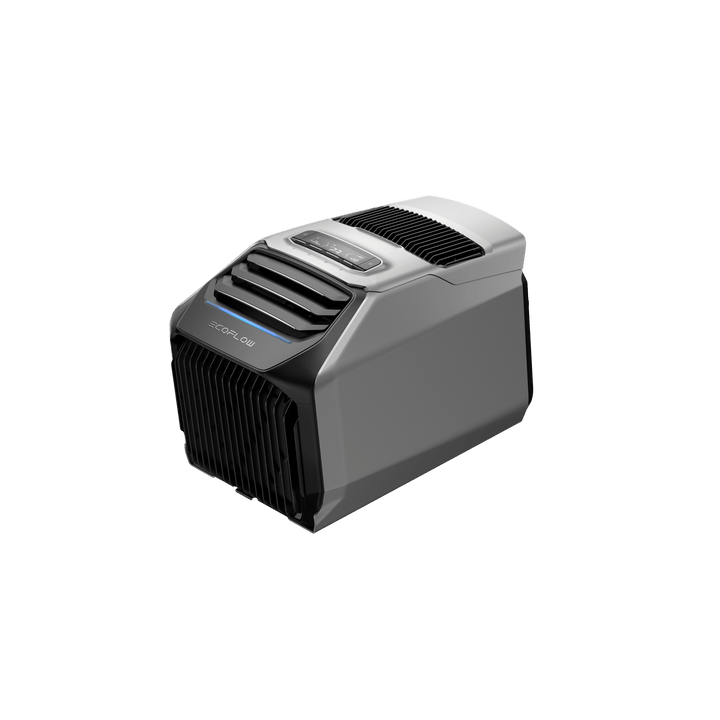

# EcoFlow WAVE

<picture><source srcset="../../../custom_components/ecoflow_iot/www/devices/wave.webp" type="image/webp"></picture>

**Category:** Smart Living · **Auto-detected by SN prefix:** `KT21ZCH2`

> Generated from `custom_components/ecoflow_iot/devices/smart_living/wave.py` by `scripts/gen_device_docs.py` — do not edit by hand.
> Every device also exposes an always-available **Connection** diagnostic sensor (MQTT state + data source).

Legend: 🔧 = diagnostic entity · 💤 = disabled by default · 🌐 = HTTP-only (refreshed on a slower HTTP cadence, not via MQTT) · ⚠️ = undocumented (reverse-engineered, may break).

## Sensors

| Entity | Device class | Unit | Quota key | Flags |
|---|---|---|---|---|
| Ambient temperature | temperature | °C | `pd.envTemp` |  |
| Air outlet temperature | temperature | °C | `pd.coolTemp` |  |
| Condensation temperature | temperature | °C | `pd.condTemp` | 🔧 |
| Condensation zone return air temperature | temperature | °C | `pd.heatEnv` | 🔧 |
| Evaporation temperature | temperature | °C | `pd.evapTemp` | 🔧 |
| Evaporation zone return air temperature | temperature | °C | `pd.airInTemp` | 🔧 |
| Exhaust temperature | temperature | °C | `pd.motorOutTemp` | 🔧 |
| Set temperature (Celsius) | temperature | °C | `pd.setTempCel` | 🔧 |
| NTC temperature | temperature | °C | `pd.tempNtc` | 🔧 💤 |
| AC input power | power | W | `pd.acPwrIn` |  |
| System power | power | W | `pd.sysPowerWatts` |  |
| PV input power | power | W | `pd.mpptPwr` |  |
| Battery output power | power | W | `pd.batPwrOut` |  |
| AC input voltage | voltage | V | `power.acVoltRms` | 🔧 |
| AC input current | current | A | `power.acCurrRms` | 🔧 |
| AC input frequency | frequency | Hz | `pd.acFreq` | 🔧 |
| Battery | battery | % | `bms.bmsSoc` |  |
| Battery (PD) | battery | % | `pd.batSoc` | 💤 |
| Battery voltage | voltage | V | `pd.batVolt` | 🔧 |
| BMS voltage | voltage | V | `bms.bmsVol` | 🔧 💤 |
| BMS current | current | A | `bms.bmsCur` | 🔧 |
| Battery time to full | duration | min | `pd.batChgRemain` | 🔧 |
| Battery time to empty | duration | min | `pd.batDsgRemain` | 🔧 |
| Timer remaining | duration | min | `pd.timeRemain` |  |
| Water level | — | — | `pd.waterValue` |  |
| Solar energy | energy | Wh | _integrated_ |  |
| Energy consumption | energy | Wh | _integrated_ |  |

## Binary sensors

| Entity | Device class | Quota key | Flags |
|---|---|---|---|
| Cool/Heat mode available | running | `pd.refEn` |  |
| Battery hardware present | connectivity | `bms.bmsHwFlag` | 🔧 |
| Battery software present | connectivity | `bms.bmsSwFlag` | 🔧 💤 |
| Battery undervoltage | problem | `pd.bmsUnderVoltage` | 🔧 |
| High pressure protection | safety | `motor.hpProtFlg` | 🔧 |
| Energy-saving shutdown | — | `motor.ecoStopFlag` | 🔧 |

## Switches

| Entity | Quota key | Flags |
|---|---|---|
| Power | `pd.powerMode` |  |
| Buzzer | `pd.beepEn` |  |
| Timer | `pd.timeEn` |  |

## Numbers

| Entity | Unit | Range | Quota key | Flags |
|---|---|---|---|---|
| Set temperature | °C | 16–30 (step 1) | `pd.setTemp` |  |
| Timer duration | min | 0–65535 (step 1) | `pd.timeSet` |  |
| Screen timeout | s | 0–3600 (step 1) | `pd.idleTime` |  |

## Selects

| Entity | Options | Quota key | Flags |
|---|---|---|---|
| Mode | cool, heat, fan | `pd.mainMode` |  |
| Sub-mode | max, sleep, eco, manual | `pd.pdSubMode` |  |
| Fan speed | low, medium, high | `pd.fanValue` |  |
| Light strip | follow_screen, always_on, always_off | `pd.rgbState` |  |
| Automatic drainage | manual_on, no_drain_on, manual_off, no_drain_off | `pd.wteFthEn` |  |
| Temperature display | ambient, outlet | `pd.tempDisplay` |  |

---

_Entity totals: 45 — 27 sensor, 6 binary_sensor, 3 switch, 3 number, 6 select, 0 light._
