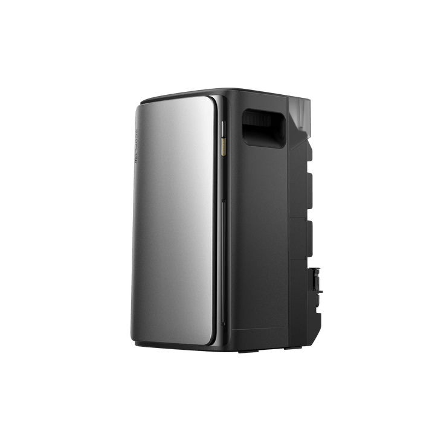

# EcoFlow PowerStream

<picture><source srcset="../../../custom_components/ecoflow_iot/www/devices/stream-ultra.webp" type="image/webp"></picture>

**Category:** Solar Systems · **Auto-detected by SN prefix:** `HW51`

> Generated from `custom_components/ecoflow_iot/devices/solar_systems/power_stream.py` by `scripts/gen_device_docs.py` — do not edit by hand.
> Every device also exposes an always-available **Connection** diagnostic sensor (MQTT state + data source).

Legend: 🔧 = diagnostic entity · 💤 = disabled by default · 🌐 = HTTP-only (refreshed on a slower HTTP cadence, not via MQTT) · ⚠️ = undocumented (reverse-engineered, may break).

## Sensors

| Entity | Device class | Unit | Quota key | Flags |
|---|---|---|---|---|
| Battery | battery | % | `20_1.batSoc` |  |
| Battery voltage | voltage | V | `20_1.batInputVolt` | 🔧 |
| Battery current | current | A | `20_1.batInputCur` | 🔧 |
| Battery power | power | W | `20_1.batInputWatts` |  |
| Battery temperature | temperature | °C | `20_1.batTemp` | 🔧 |
| Time to full | duration | min | `20_1.chgRemainTime` | 🔧 |
| Time to empty | duration | min | `20_1.dsgRemainTime` | 🔧 |
| Solar string 1 power | power | W | `20_1.pv1InputWatts` |  |
| Solar string 1 voltage | voltage | V | `20_1.pv1InputVolt` | 🔧 💤 |
| Solar string 1 current | current | A | `20_1.pv1InputCur` | 🔧 💤 |
| Solar string 1 temperature | temperature | °C | `20_1.pv1Temp` | 🔧 💤 |
| Solar string 2 power | power | W | `20_1.pv2InputWatts` |  |
| Solar string 2 voltage | voltage | V | `20_1.pv2InputVolt` | 🔧 💤 |
| Solar string 2 current | current | A | `20_1.pv2InputCur` | 🔧 💤 |
| Solar string 2 temperature | temperature | °C | `20_1.pv2Temp` | 🔧 💤 |
| Inverter output power | power | W | `20_1.invOutputWatts` |  |
| Inverter output current | current | A | `20_1.invOutputCur` | 🔧 💤 |
| Inverter frequency | frequency | Hz | `20_1.invFreq` | 🔧 |
| Inverter temperature | temperature | °C | `20_1.invTemp` | 🔧 |
| Custom load power setpoint | power | W | `20_1.permanentWatts` | 🔧 |
| Dynamic load power | power | W | `20_1.dynamicWatts` | 🔧 💤 |
| INV power after derating | power | W | `20_1.floadLimitOut` | 🔧 💤 |
| PV power after derating | power | W | `20_1.invOutputLoadLimit` | 🔧 💤 |
| BAT power after derating | power | W | `20_1.batOutputLoadLimit` | 🔧 💤 |
| Limited AC output (low PV) | power | W | `20_1.pvPowerLimitAcPower` | 🔧 💤 |
| LLC input voltage | voltage | V | `20_1.llcInputVolt` | 🔧 💤 |
| LLC temperature | temperature | °C | `20_1.llcTemp` | 🔧 💤 |
| Wi-Fi signal | signal_strength | dBm | `20_1.wifiRssi` | 🔧 💤 |
| Rated power | power | W | `20_1.ratedPower` | 🔧 💤 |
| LED brightness | — | — | `20_1.invBrightness` | 🔧 💤 |
| Restart count | — | — | `20_1.resetCount` | 🔧 💤 |
| Solar energy | energy | Wh | _integrated_ |  |
| Battery charge energy | energy | Wh | _integrated_ |  |
| Battery discharge energy | energy | Wh | _integrated_ |  |

## Binary sensors

| Entity | Device class | Quota key | Flags |
|---|---|---|---|
| Battery charging | battery_charging | `20_1.batInputWatts` |  |
| Solar string 1 active | running | `20_1.pv1CtrlMpptOffFlag` | 🔧 |
| Solar string 2 active | running | `20_1.pv2CtrlMpptOffFlag` | 🔧 |
| Battery active | running | `20_1.batOffFlag` | 🔧 |
| Inverter on | running | `20_1.invOnOff` | 🔧 |
| Anti-backflow active | — | `20_1.antiBackFlowFlag` | 🔧 💤 |
| INV module derated | — | `20_1.uwloadLimitFlag` | 🔧 💤 |
| PV module derated | — | `20_1.invLoadLimitFlag` | 🔧 💤 |
| BAT module derated | — | `20_1.batLoadLimitFlag` | 🔧 💤 |
| Feed-in protection | — | `20_1.feedProtect` | 🔧 |

## Numbers

| Entity | Unit | Range | Quota key | Flags |
|---|---|---|---|---|
| Custom load power | W | 0–600 (step 1) | `20_1.permanentWatts` |  |
| Discharge limit | % | 1–30 (step 1) | `20_1.lowerLimit` |  |
| Charge limit | % | 70–100 (step 1) | `20_1.upperLimit` |  |
| LED brightness | — | 0–1023 (step 1) | `20_1.invBrightness` |  |

## Selects

| Entity | Options | Quota key | Flags |
|---|---|---|---|
| Power supply priority | 0, 1 | `20_1.supplyPriority` |  |

---

_Entity totals: 49 — 34 sensor, 10 binary_sensor, 0 switch, 4 number, 1 select, 0 light._
