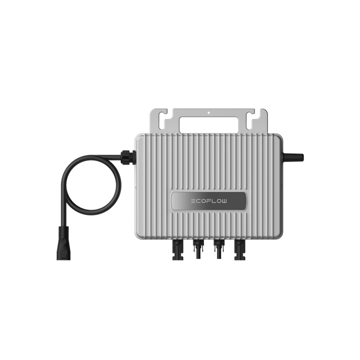

# EcoFlow Stream Microinverter

<picture><source srcset="../../../custom_components/ecoflow_iot/www/devices/stream-microinverter.webp" type="image/webp"></picture>

**Category:** Solar Systems · **Auto-detected by SN prefix:** `BK`

> Generated from `custom_components/ecoflow_iot/devices/solar_systems/stream.py` by `scripts/gen_device_docs.py` — do not edit by hand.
> Every device also exposes an always-available **Connection** diagnostic sensor (MQTT state + data source).

Legend: 🔧 = diagnostic entity · 💤 = disabled by default · 🌐 = HTTP-only (refreshed on a slower HTTP cadence, not via MQTT) · ⚠️ = undocumented (reverse-engineered, may break).

> ⚠️ **Heads-up:** entities flagged ⚠️ are reverse-engineered from live device data and are **not part of EcoFlow's documented API**. They may change behaviour or stop working after a device firmware or EcoFlow app update.

## Sensors

| Entity | Device class | Unit | Quota key | Flags |
|---|---|---|---|---|
| Grid power | power | W | `gridConnectionPower` |  |
| System grid power | power | W | `sysGridConnectionPower` | 💤 |
| Grid voltage | voltage | V | `gridConnectionVol` | 🔧 |
| Grid frequency | frequency | Hz | `gridConnectionFreq` | 🔧 |
| Inverter temperature | temperature | °C | `invNtcTemp3` | 🔧 |
| Total AC power | power | W | `acTotalActivePower` | ⚠️ |
| Grid connection status | — | — | `gridConnectionSta` | 🔧 ⚠️ |
| Meter phase A power | power | W | `cloudMetter.phaseAPower` | 💤 |
| Solar power | power | W | `powGetPvSum` |  |
| Solar string 1 power | power | W | _computed_ |  |
| Solar string 1 voltage | voltage | V | `plugInInfoPvVol` | 🔧 💤 |
| Solar string 1 current | current | A | `plugInInfoPvAmp` | 🔧 💤 |
| Solar string 2 power | power | W | _computed_ |  |
| Solar string 2 voltage | voltage | V | `plugInInfoPv2Vol` | 🔧 💤 |
| Solar string 2 current | current | A | `plugInInfoPv2Amp` | 🔧 💤 |
| Solar energy | energy | Wh | _integrated_ |  |
| Grid import energy | energy | Wh | `gridConnectionPower` |  |
| Grid export energy | energy | Wh | `gridConnectionPower` |  |
| Wi-Fi signal | signal_strength | dBm | `moduleWifiRssi` | 🔧 💤 |
| Feed-in power limit | power | W | `feedGridModePowLimit` | 🔧 |

## Binary sensors

| Entity | Device class | Quota key | Flags |
|---|---|---|---|
| Solar string 1 connected | connectivity | `plugInInfoPvFlag` | 🔧 💤 |
| Solar string 2 connected | connectivity | `plugInInfoPv2Flag` | 🔧 💤 |

---

_Entity totals: 22 — 20 sensor, 2 binary_sensor, 0 switch, 0 number, 0 select._
