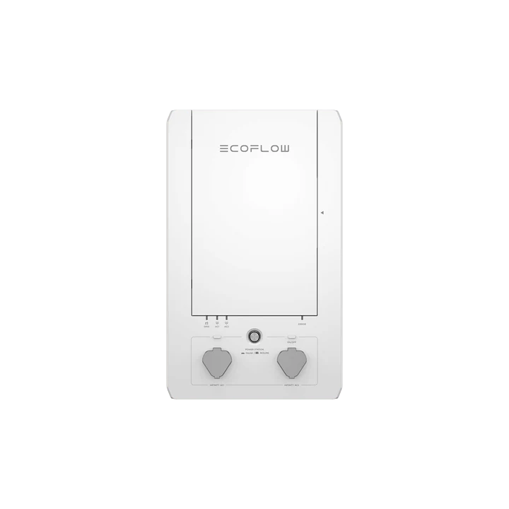

# EcoFlow Smart Home Panel

**Category:** Whole-Home Backup · **Auto-detected by SN prefix:** `SP10`

> Generated from `custom_components/ecoflow_iot/devices/whole_home_backup/smart_home_panel.py` by `scripts/gen_device_docs.py` — do not edit by hand.
> Every device also exposes an always-available **Connection** diagnostic sensor (MQTT state + data source).

Legend: 🔧 = diagnostic entity · 💤 = disabled by default · 🌐 = HTTP-only (refreshed on a slower HTTP cadence, not via MQTT) · ⚠️ = undocumented (reverse-engineered, may break).

> ⚠️ **Heads-up:** entities flagged ⚠️ are reverse-engineered from live device data and are **not part of EcoFlow's documented API**. They may change behaviour or stop working after a device firmware or EcoFlow app update.

## Sensors

| Entity | Device class | Unit | Quota key | Flags |
|---|---|---|---|---|
| Backup battery | battery | % | `heartbeat.backupBatPer` |  |
| Backup full capacity | energy_storage | Wh | `heartbeat.backupFullCap` | 🔧 |
| Grid energy today | energy | Wh | `heartbeat.gridDayWatth` |  |
| Backup energy today | energy | Wh | `heartbeat.backupDayWatth` |  |
| Backup discharge time remaining | duration | min | `heartbeat.backupChaTime` | 🔧 |
| Device work time | duration | min | `heartbeat.workTime` | 🔧 💤 |
| Grid voltage | voltage | V | `gridInfo.gridVol` | 🔧 |
| Grid frequency | frequency | Hz | `gridInfo.gridFreq` | 🔧 |
| Charge upper threshold | battery | % | `backupChaDiscCfg.forceChargeHigh` | 🔧 |
| Discharge lower threshold | battery | % | `backupChaDiscCfg.discLower` | 🔧 |
| Channel 1 power | power | W | _computed_ | ⚠️ |
| Channel 1 name | — | — | _computed_ | 🔧 ⚠️ |
| Channel 1 grid energy today | energy | Wh | _computed_ | ⚠️ |
| Channel 1 battery energy today | energy | Wh | _computed_ | ⚠️ |
| Channel 1 input voltage | voltage | V | _computed_ | 🔧 💤 ⚠️ |
| Channel 1 state | — | — | _computed_ |  |
| Channel 1 configured current | current | A | _computed_ | 🔧 |
| Channel 1 backup priority | — | — | _computed_ | 🔧 |
| Channel 2 power | power | W | _computed_ | ⚠️ |
| Channel 2 name | — | — | _computed_ | 🔧 ⚠️ |
| Channel 2 grid energy today | energy | Wh | _computed_ | ⚠️ |
| Channel 2 battery energy today | energy | Wh | _computed_ | ⚠️ |
| Channel 2 input voltage | voltage | V | _computed_ | 🔧 💤 ⚠️ |
| Channel 2 state | — | — | _computed_ |  |
| Channel 2 configured current | current | A | _computed_ | 🔧 |
| Channel 2 backup priority | — | — | _computed_ | 🔧 |
| Channel 3 power | power | W | _computed_ | ⚠️ |
| Channel 3 name | — | — | _computed_ | 🔧 ⚠️ |
| Channel 3 grid energy today | energy | Wh | _computed_ | ⚠️ |
| Channel 3 battery energy today | energy | Wh | _computed_ | ⚠️ |
| Channel 3 input voltage | voltage | V | _computed_ | 🔧 💤 ⚠️ |
| Channel 3 state | — | — | _computed_ |  |
| Channel 3 configured current | current | A | _computed_ | 🔧 |
| Channel 3 backup priority | — | — | _computed_ | 🔧 |
| Channel 4 power | power | W | _computed_ | ⚠️ |
| Channel 4 name | — | — | _computed_ | 🔧 ⚠️ |
| Channel 4 grid energy today | energy | Wh | _computed_ | ⚠️ |
| Channel 4 battery energy today | energy | Wh | _computed_ | ⚠️ |
| Channel 4 input voltage | voltage | V | _computed_ | 🔧 💤 ⚠️ |
| Channel 4 state | — | — | _computed_ |  |
| Channel 4 configured current | current | A | _computed_ | 🔧 |
| Channel 4 backup priority | — | — | _computed_ | 🔧 |
| Channel 5 power | power | W | _computed_ | ⚠️ |
| Channel 5 name | — | — | _computed_ | 🔧 ⚠️ |
| Channel 5 grid energy today | energy | Wh | _computed_ | ⚠️ |
| Channel 5 battery energy today | energy | Wh | _computed_ | ⚠️ |
| Channel 5 input voltage | voltage | V | _computed_ | 🔧 💤 ⚠️ |
| Channel 5 state | — | — | _computed_ |  |
| Channel 5 configured current | current | A | _computed_ | 🔧 |
| Channel 5 backup priority | — | — | _computed_ | 🔧 |
| Channel 6 power | power | W | _computed_ | ⚠️ |
| Channel 6 name | — | — | _computed_ | 🔧 ⚠️ |
| Channel 6 grid energy today | energy | Wh | _computed_ | ⚠️ |
| Channel 6 battery energy today | energy | Wh | _computed_ | ⚠️ |
| Channel 6 input voltage | voltage | V | _computed_ | 🔧 💤 ⚠️ |
| Channel 6 state | — | — | _computed_ |  |
| Channel 6 configured current | current | A | _computed_ | 🔧 |
| Channel 6 backup priority | — | — | _computed_ | 🔧 |
| Channel 7 power | power | W | _computed_ | ⚠️ |
| Channel 7 name | — | — | _computed_ | 🔧 ⚠️ |
| Channel 7 grid energy today | energy | Wh | _computed_ | ⚠️ |
| Channel 7 battery energy today | energy | Wh | _computed_ | ⚠️ |
| Channel 7 input voltage | voltage | V | _computed_ | 🔧 💤 ⚠️ |
| Channel 7 state | — | — | _computed_ |  |
| Channel 7 configured current | current | A | _computed_ | 🔧 |
| Channel 7 backup priority | — | — | _computed_ | 🔧 |
| Channel 8 power | power | W | _computed_ | ⚠️ |
| Channel 8 name | — | — | _computed_ | 🔧 ⚠️ |
| Channel 8 grid energy today | energy | Wh | _computed_ | ⚠️ |
| Channel 8 battery energy today | energy | Wh | _computed_ | ⚠️ |
| Channel 8 input voltage | voltage | V | _computed_ | 🔧 💤 ⚠️ |
| Channel 8 state | — | — | _computed_ |  |
| Channel 8 configured current | current | A | _computed_ | 🔧 |
| Channel 8 backup priority | — | — | _computed_ | 🔧 |
| Channel 9 power | power | W | _computed_ | ⚠️ |
| Channel 9 name | — | — | _computed_ | 🔧 ⚠️ |
| Channel 9 grid energy today | energy | Wh | _computed_ | ⚠️ |
| Channel 9 battery energy today | energy | Wh | _computed_ | ⚠️ |
| Channel 9 input voltage | voltage | V | _computed_ | 🔧 💤 ⚠️ |
| Channel 9 state | — | — | _computed_ |  |
| Channel 9 configured current | current | A | _computed_ | 🔧 |
| Channel 9 backup priority | — | — | _computed_ | 🔧 |
| Channel 10 power | power | W | _computed_ | ⚠️ |
| Channel 10 name | — | — | _computed_ | 🔧 ⚠️ |
| Channel 10 grid energy today | energy | Wh | _computed_ | ⚠️ |
| Channel 10 battery energy today | energy | Wh | _computed_ | ⚠️ |
| Channel 10 input voltage | voltage | V | _computed_ | 🔧 💤 ⚠️ |
| Channel 10 state | — | — | _computed_ |  |
| Channel 10 configured current | current | A | _computed_ | 🔧 |
| Channel 10 backup priority | — | — | _computed_ | 🔧 |
| Battery port 1 power | power | W | _computed_ | 💤 ⚠️ |
| Battery port 1 battery | battery | % | _computed_ |  |
| Battery port 1 output power | power | W | _computed_ |  |
| Battery port 1 temperature | temperature | °C | _computed_ | 🔧 |
| Battery port 1 charge time remaining | duration | min | _computed_ | 🔧 💤 |
| Battery port 1 discharge time remaining | duration | min | _computed_ | 🔧 💤 |
| Battery port 1 full capacity | energy_storage | Wh | _computed_ | 🔧 💤 |
| Battery port 1 charge energy today | energy | Wh | _computed_ | ⚠️ |
| Battery port 2 power | power | W | _computed_ | 💤 ⚠️ |
| Battery port 2 battery | battery | % | _computed_ |  |
| Battery port 2 output power | power | W | _computed_ |  |
| Battery port 2 temperature | temperature | °C | _computed_ | 🔧 |
| Battery port 2 charge time remaining | duration | min | _computed_ | 🔧 💤 |
| Battery port 2 discharge time remaining | duration | min | _computed_ | 🔧 💤 |
| Battery port 2 full capacity | energy_storage | Wh | _computed_ | 🔧 💤 |
| Battery port 2 charge energy today | energy | Wh | _computed_ | ⚠️ |

## Binary sensors

| Entity | Device class | Quota key | Flags |
|---|---|---|---|
| Grid status | power | `heartbeat.gridSta` |  |
| EPS mode | running | `epsModeInfo.eps` |  |
| Channel 1 on | power | _computed_ |  |
| Channel 1 grid source | plug | _computed_ | 💤 |
| Channel 1 emergency enabled | — | _computed_ | 💤 |
| Channel 1 configured | — | _computed_ | 🔧 💤 ⚠️ |
| Channel 1 split phase linked | — | _computed_ | 🔧 💤 ⚠️ |
| Channel 2 on | power | _computed_ |  |
| Channel 2 grid source | plug | _computed_ | 💤 |
| Channel 2 emergency enabled | — | _computed_ | 💤 |
| Channel 2 configured | — | _computed_ | 🔧 💤 ⚠️ |
| Channel 2 split phase linked | — | _computed_ | 🔧 💤 ⚠️ |
| Channel 3 on | power | _computed_ |  |
| Channel 3 grid source | plug | _computed_ | 💤 |
| Channel 3 emergency enabled | — | _computed_ | 💤 |
| Channel 3 configured | — | _computed_ | 🔧 💤 ⚠️ |
| Channel 3 split phase linked | — | _computed_ | 🔧 💤 ⚠️ |
| Channel 4 on | power | _computed_ |  |
| Channel 4 grid source | plug | _computed_ | 💤 |
| Channel 4 emergency enabled | — | _computed_ | 💤 |
| Channel 4 configured | — | _computed_ | 🔧 💤 ⚠️ |
| Channel 4 split phase linked | — | _computed_ | 🔧 💤 ⚠️ |
| Channel 5 on | power | _computed_ |  |
| Channel 5 grid source | plug | _computed_ | 💤 |
| Channel 5 emergency enabled | — | _computed_ | 💤 |
| Channel 5 configured | — | _computed_ | 🔧 💤 ⚠️ |
| Channel 5 split phase linked | — | _computed_ | 🔧 💤 ⚠️ |
| Channel 6 on | power | _computed_ |  |
| Channel 6 grid source | plug | _computed_ | 💤 |
| Channel 6 emergency enabled | — | _computed_ | 💤 |
| Channel 6 configured | — | _computed_ | 🔧 💤 ⚠️ |
| Channel 6 split phase linked | — | _computed_ | 🔧 💤 ⚠️ |
| Channel 7 on | power | _computed_ |  |
| Channel 7 grid source | plug | _computed_ | 💤 |
| Channel 7 emergency enabled | — | _computed_ | 💤 |
| Channel 7 configured | — | _computed_ | 🔧 💤 ⚠️ |
| Channel 7 split phase linked | — | _computed_ | 🔧 💤 ⚠️ |
| Channel 8 on | power | _computed_ |  |
| Channel 8 grid source | plug | _computed_ | 💤 |
| Channel 8 emergency enabled | — | _computed_ | 💤 |
| Channel 8 configured | — | _computed_ | 🔧 💤 ⚠️ |
| Channel 8 split phase linked | — | _computed_ | 🔧 💤 ⚠️ |
| Channel 9 on | power | _computed_ |  |
| Channel 9 grid source | plug | _computed_ | 💤 |
| Channel 9 emergency enabled | — | _computed_ | 💤 |
| Channel 9 configured | — | _computed_ | 🔧 💤 ⚠️ |
| Channel 9 split phase linked | — | _computed_ | 🔧 💤 ⚠️ |
| Channel 10 on | power | _computed_ |  |
| Channel 10 grid source | plug | _computed_ | 💤 |
| Channel 10 emergency enabled | — | _computed_ | 💤 |
| Channel 10 configured | — | _computed_ | 🔧 💤 ⚠️ |
| Channel 10 split phase linked | — | _computed_ | 🔧 💤 ⚠️ |
| Battery port 1 connected | connectivity | _computed_ | 🔧 |
| Battery port 1 grid charging | battery_charging | _computed_ | 💤 |
| Battery port 1 output | power | _computed_ | 💤 |
| Battery port 2 connected | connectivity | _computed_ | 🔧 |
| Battery port 2 grid charging | battery_charging | _computed_ | 💤 |
| Battery port 2 output | power | _computed_ | 💤 |

## Switches

| Entity | Quota key | Flags |
|---|---|---|
| EPS mode | `epsModeInfo.eps` |  |
| Channel 1 | _computed_ |  |
| Channel 2 | _computed_ |  |
| Channel 3 | _computed_ |  |
| Channel 4 | _computed_ |  |
| Channel 5 | _computed_ |  |
| Channel 6 | _computed_ |  |
| Channel 7 | _computed_ |  |
| Channel 8 | _computed_ |  |
| Channel 9 | _computed_ |  |
| Channel 10 | _computed_ |  |
| Channel 1 emergency enable | _computed_ | 💤 |
| Channel 2 emergency enable | _computed_ | 💤 |
| Channel 3 emergency enable | _computed_ | 💤 |
| Channel 4 emergency enable | _computed_ | 💤 |
| Channel 5 emergency enable | _computed_ | 💤 |
| Channel 6 emergency enable | _computed_ | 💤 |
| Channel 7 emergency enable | _computed_ | 💤 |
| Channel 8 emergency enable | _computed_ | 💤 |
| Channel 9 emergency enable | _computed_ | 💤 |
| Channel 10 emergency enable | _computed_ | 💤 |

## Numbers

| Entity | Unit | Range | Quota key | Flags |
|---|---|---|---|---|
| Charge upper threshold | % | 0–100 (step 1) | `backupChaDiscCfg.forceChargeHigh` |  |
| Discharge lower threshold | % | 0–100 (step 1) | `backupChaDiscCfg.discLower` |  |

---

_Entity totals: 187 — 106 sensor, 58 binary_sensor, 21 switch, 2 number, 0 select, 0 light._
