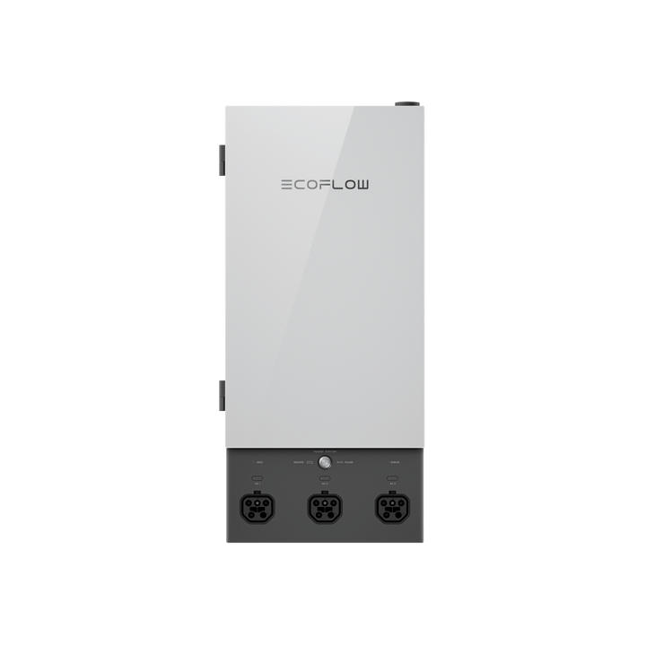

# EcoFlow Smart Home Panel 2

**Category:** Whole-Home Backup · **Auto-detected by SN prefix:** `HD31`

> Generated from `custom_components/ecoflow_iot/devices/whole_home_backup/smart_home_panel_ii.py` by `scripts/gen_device_docs.py` — do not edit by hand.
> Every device also exposes an always-available **Connection** diagnostic sensor (MQTT state + data source).

Legend: 🔧 = diagnostic entity · 💤 = disabled by default · 🌐 = HTTP-only (refreshed on a slower HTTP cadence, not via MQTT).

## Sensors

| Entity | Device class | Unit | Quota key | Flags |
|---|---|---|---|---|
| Grid power | power | W | `wattInfo.gridWatt` |  |
| Home power | power | W | `wattInfo.allHallWatt` |  |
| Backup battery | battery | % | `backupIncreInfo.backupBatPer` |  |
| Backup time remaining | duration | min | `backupInfo.backupDischargeTime` | 🔧 |
| Home max current | current | A | `masterCur` | 🔧 |
| Generator max output | power | W | `oilMaxOutputWatt` | 🔧 |
| Charging power | power | W | `chargeWattPower` | 🔧 |
| Charging limit | battery | % | `foceChargeHight` | 🔧 |
| Backup reserve | battery | % | `backupReserveSoc` | 🔧 |
| AC1 power | power | W | _computed_ |  |
| AC1 battery | battery | % | `backupIncreInfo.Energy1Info.batteryPercentage` |  |
| AC2 power | power | W | _computed_ |  |
| AC2 battery | battery | % | `backupIncreInfo.Energy2Info.batteryPercentage` |  |
| AC3 power | power | W | _computed_ |  |
| AC3 battery | battery | % | `backupIncreInfo.Energy3Info.batteryPercentage` |  |
| Circuit 1 power | power | W | _computed_ |  |
| Circuit 1 max current | current | A | `loadIncreInfo.hall1IncreInfo.ch1Info.setAmp` | 🔧 💤 |
| Circuit 2 power | power | W | _computed_ |  |
| Circuit 2 max current | current | A | `loadIncreInfo.hall1IncreInfo.ch2Info.setAmp` | 🔧 💤 |
| Circuit 3 power | power | W | _computed_ |  |
| Circuit 3 max current | current | A | `loadIncreInfo.hall1IncreInfo.ch3Info.setAmp` | 🔧 💤 |
| Circuit 4 power | power | W | _computed_ |  |
| Circuit 4 max current | current | A | `loadIncreInfo.hall1IncreInfo.ch4Info.setAmp` | 🔧 💤 |
| Circuit 5 power | power | W | _computed_ |  |
| Circuit 5 max current | current | A | `loadIncreInfo.hall1IncreInfo.ch5Info.setAmp` | 🔧 💤 |
| Circuit 6 power | power | W | _computed_ |  |
| Circuit 6 max current | current | A | `loadIncreInfo.hall1IncreInfo.ch6Info.setAmp` | 🔧 💤 |
| Circuit 7 power | power | W | _computed_ |  |
| Circuit 7 max current | current | A | `loadIncreInfo.hall1IncreInfo.ch7Info.setAmp` | 🔧 💤 |
| Circuit 8 power | power | W | _computed_ |  |
| Circuit 8 max current | current | A | `loadIncreInfo.hall1IncreInfo.ch8Info.setAmp` | 🔧 💤 |
| Circuit 9 power | power | W | _computed_ |  |
| Circuit 9 max current | current | A | `loadIncreInfo.hall1IncreInfo.ch9Info.setAmp` | 🔧 💤 |
| Circuit 10 power | power | W | _computed_ |  |
| Circuit 10 max current | current | A | `loadIncreInfo.hall1IncreInfo.ch10Info.setAmp` | 🔧 💤 |
| Circuit 11 power | power | W | _computed_ |  |
| Circuit 11 max current | current | A | `loadIncreInfo.hall1IncreInfo.ch11Info.setAmp` | 🔧 💤 |
| Circuit 12 power | power | W | _computed_ |  |
| Circuit 12 max current | current | A | `loadIncreInfo.hall1IncreInfo.ch12Info.setAmp` | 🔧 💤 |
| Grid import energy | energy | Wh | _integrated_ |  |
| Grid export energy | energy | Wh | _integrated_ |  |
| Home energy | energy | Wh | _integrated_ |  |

## Binary sensors

| Entity | Device class | Quota key | Flags |
|---|---|---|---|
| Battery charging | battery_charging | `chargeWattPower` |  |
| Storm warning | safety | `stormIsEnable` |  |
| EPS mode | power | `epsModeInfo` | 🔧 |

## Switches

| Entity | Quota key | Flags |
|---|---|---|
| Storm warning | `stormIsEnable` |  |
| EPS mode | `epsModeInfo` |  |
| AC1 channel | `ch1EnableSet` |  |
| AC2 channel | `ch2EnableSet` |  |
| AC3 channel | `ch3EnableSet` |  |
| AC1 force charge | `ch1ForceCharge` |  |
| AC2 force charge | `ch2ForceCharge` |  |
| AC3 force charge | `ch3ForceCharge` |  |

## Numbers

| Entity | Unit | Range | Quota key | Flags |
|---|---|---|---|---|
| Backup reserve level | % | 0–100 (step 1) | `backupReserveSoc` |  |
| Charging power | W | 500–7200 (step 100) | `chargeWattPower` |  |
| Charging limit | % | 80–100 (step 1) | `foceChargeHight` |  |
| Generator max output | W | 3000–12000 (step 1000) | `oilMaxOutputWatt` |  |
| Home max current | A | 6–10 (step 0.1) | `masterCur` |  |
| Circuit 1 max current | A | 10–60 (step 5) | `loadIncreInfo.hall1IncreInfo.ch1Info.setAmp` | 💤 |
| Circuit 2 max current | A | 10–60 (step 5) | `loadIncreInfo.hall1IncreInfo.ch2Info.setAmp` | 💤 |
| Circuit 3 max current | A | 10–60 (step 5) | `loadIncreInfo.hall1IncreInfo.ch3Info.setAmp` | 💤 |
| Circuit 4 max current | A | 10–60 (step 5) | `loadIncreInfo.hall1IncreInfo.ch4Info.setAmp` | 💤 |
| Circuit 5 max current | A | 10–60 (step 5) | `loadIncreInfo.hall1IncreInfo.ch5Info.setAmp` | 💤 |
| Circuit 6 max current | A | 10–60 (step 5) | `loadIncreInfo.hall1IncreInfo.ch6Info.setAmp` | 💤 |
| Circuit 7 max current | A | 10–60 (step 5) | `loadIncreInfo.hall1IncreInfo.ch7Info.setAmp` | 💤 |
| Circuit 8 max current | A | 10–60 (step 5) | `loadIncreInfo.hall1IncreInfo.ch8Info.setAmp` | 💤 |
| Circuit 9 max current | A | 10–60 (step 5) | `loadIncreInfo.hall1IncreInfo.ch9Info.setAmp` | 💤 |
| Circuit 10 max current | A | 10–60 (step 5) | `loadIncreInfo.hall1IncreInfo.ch10Info.setAmp` | 💤 |
| Circuit 11 max current | A | 10–60 (step 5) | `loadIncreInfo.hall1IncreInfo.ch11Info.setAmp` | 💤 |
| Circuit 12 max current | A | 10–60 (step 5) | `loadIncreInfo.hall1IncreInfo.ch12Info.setAmp` | 💤 |

## Selects

| Entity | Options | Quota key | Flags |
|---|---|---|---|
| smart_backup_mode | disabled, tou, self_service, timed | _derived_ |  |

---

_Entity totals: 71 — 42 sensor, 3 binary_sensor, 8 switch, 17 number, 1 select._
